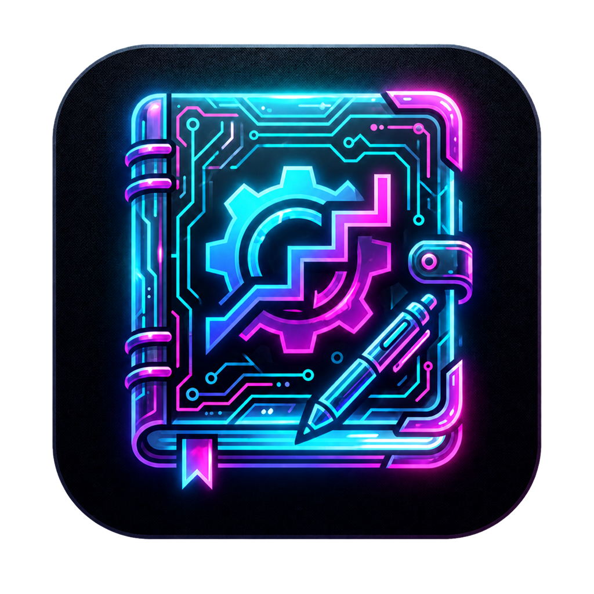

# ShopLog Forge

<p align="center">
  
</p>

[](https://github.com/gsabin86-ctrl/shoplogforge/actions/workflows/ios-build.yml)

Cross-platform, phone-first production tracking and ECAS-20 machine setup
sheets for Texas Swiss.

## Project layout

| Folder | Platform | Purpose |
| --- | --- | --- |
| `shared/` | All platforms | Canonical offline ShopLog interface and business logic |
| `android/` | Android | Native WebView wrapper, Android storage bridge, and APK build |
| `ios/` | iPhone | Native Swift/WKWebView wrapper and Xcode project definition |
| `releases/` | Installers | Signed Android APK releases |
| `index.html` | Browser | Standalone local/web version |

Both mobile apps bundle the same ShopLog interface. Platform folders contain
only the native code needed for installation, safe areas, local files, and
operating-system integration. Each phone keeps its own local records; ShopLog's
JSON export/import moves data between Android, iPhone, and browser versions.

## Run the app

No build or package installation is required. Open `index.html` directly, or
serve this folder with any static web server.

For example:

```bash
npx serve .
```

Then open the local URL shown in the terminal.

## Included features

- Production, OEE, orders, machines, and downtime tracking
- Permanent editable tool library
- ECAS-20 setup sheets with 1-24 available stations
- Tool assignments pulled from the master library
- Expandable saved setup reviews
- Completed setup sorting by part number and program number
- CNC Toolbase search links
- JSON and CSV exports with optional folder-aware saving

App data is stored in the browser on the device where it is entered. Export
regular backups from ShopLog, especially before clearing browser data or moving
to another device.

## Android app

The `android/` folder contains the offline Android wrapper. It bundles ShopLog
inside a permanent app installation so refreshes do not depend on temporary
file-browser access. Android exports are written to `Downloads/ShopLog`, and
JSON imports use the system file picker.

The signed Android 1.3 installer is available at
[`releases/ShopLog-Android-v1.3.apk`](releases/ShopLog-Android-v1.3.apk).
Install it over an earlier ShopLog APK to retain the app's local data.

The build requires Android Platform 36, Build Tools 36.0.0, and Java 17 or
newer. Run `android/build.ps1` to create `android/build/ShopLog-Android.apk`.

## iPhone app

The `ios/` folder contains the Swift iPhone wrapper and an XcodeGen project
definition. It stores ShopLog data locally, respects the notch/Dynamic Island
and home indicator, exposes exports through the Files app, and opens external
tool links in Safari.

The final iPhone build and Apple signing step must run through Xcode on macOS.
See [`ios/README.md`](ios/README.md) for generation, device installation, and
distribution instructions.
